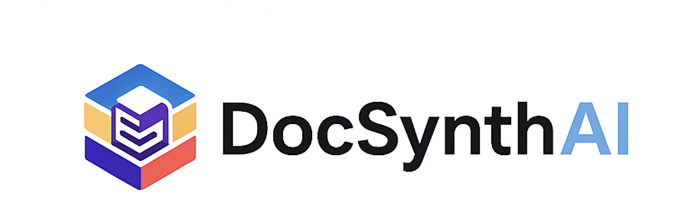

DocSynthAI – Intelligent Document Processing MCP Server

🌟 About DocSynthAI

DocSynthAI is an open-source Intelligent Document Processing (IDP) engine powered by the Model Context Protocol (MCP).
It is built to make unstructured documents understandable, extractable, validatable, and machine-ready — using AI, NLP, OCR, and rule-based business logic.

✨ What DocSynthAI Does
🔹 Transforms unstructured documents into structured intelligence

DocSynthAI reads any document (PDF, Image, Scanned copy, Docx) and converts it into clean, normalized, business-friendly data.

🔹 Acts as an MCP Server

So any LLM, ChatGPT client, agentic system, or automation pipeline can connect and process documents seamlessly.

🔹 Provides a modular, pluggable IDP Pipeline

Each stage is designed as a pluggable unit:

OCR

Layout detection

Classification

Entity extraction

Field normalization

Canonical business validation

Output formatting & enrichment

🚀 Core Highlights
⭐ 1. AI-powered Document Classification

Identifies document type: invoices, statements, contracts, forms, etc.

Multi-lingual, multi-modal support

Hybrid rules + ML models for high accuracy

⭐ 2. Smart Extraction Engine

OCR + NLP combined extraction

Table detection & parsing

Key-value pair extraction

Entity recognition

Semantic chunking

Multi-page & multi-format support

⭐ 3. Canonical Business Validation

Validates extracted data against:

Domain rules

Business logic

Cross-field consistency

Regulatory patterns

Date / number normalization

Generates a uniform “canonical schema”

⭐ 4. Plug-and-Play with MCP

Exposes all capabilities through MCP

Enables integration with:

LLMs

ChatGPT clients

Agent frameworks

Workflow engines

Automation pipelines

⭐ 5. Extensible by Design

Add custom validators

Add new extractors

Add new classification schemas

Override pipeline components

Inject your own ML models

📁 Supported Document Types

Invoices

KYC documents

Bank statements

Insurance forms

Government IDs

Utility bills

Contracts & agreements

Custom enterprise formats

🔧 Why DocSynthAI?
✔ Built for developers

Straightforward APIs, clean pipeline, and MCP integration.

✔ Built for enterprises

Stable architecture, validation layers, and audit-friendly output.

✔ Built for agents

MCP interface makes LLM-based automation extremely easy.

✔ Built for open-source community

Modular, extendable, customizable.

🧠 Vision

To make unstructured documents first-class, machine-understandable objects, enabling:

Automated workflows

Intelligent agents

RPA & back-office optimization

Compliance-ready data extraction

Enterprise-wide knowledge systems

🎉 Who Should Use DocSynthAI?

Developers building IDP products

Agentic AI platform creators

Automation engineers

Data engineers & AI teams

Enterprises processing high-volume paperwork

Anyone wanting an open-source IDP MCP server
